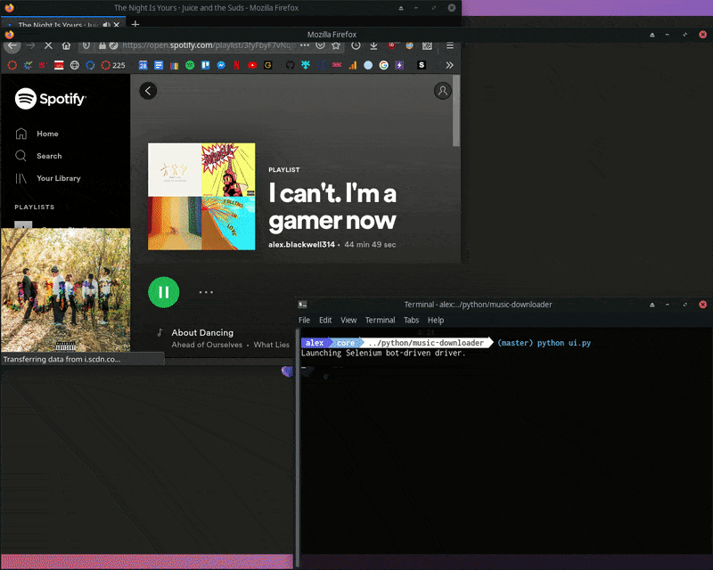
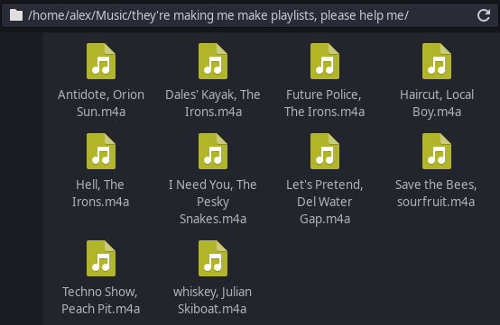

# Music Downloader

## Table of contents
* [Overview](#overview)
* [Examples](#examples)
* [Technologies](#technologies)
* [Setup](#setup)
* [Usage](#usage)
* [Limitations](#limitations)

## Overview
Download all the songs from your Spotify playlist by just pasting in the link! This program will scrape all the songs from a Spotify playlist and put it in a folder in your music directory named after the playlist. Additionally, individual songs can be added to a text prompt and those songs will be downloaded.

# Examples
### Screenshots

> Downloading the songs from my spotify playlist "I can't. I'm a gamer now"

> The folder that is made when downloading from a playlist

## Technologies
- **Python -3.8**
- **beatifulsoup4 -4.9**
  - For scraping data from the Spotify website
- **selenium -3.141**
  - Because Spotify needs the site to load JavaScript to display content
- **youtube-dl -2020.6.6**
  - For downloading videos from YouTube
- **PySimpleGUI -4.28**
  - For the Graphical User Interface

## Setup
To run this project, first install the requirements:

    pip3 install -r requirements

Note that Selenium requires a driver associated with your browser of choice, which can be downloaded off the Selenium website.
  - **Firefox driver (geckodriver)**
    - Found [here](https://github.com/mozilla/geckodriver/releases).
  - **Chrome driver (ChromeDriver)**
    - Found [here](https://sites.google.com/a/chromium.org/chromedriver/).
  - **Opera driver (operachromiumdriver)**
    - Found [here](https://github.com/operasoftware/operachromiumdriver/releases).
  - **Safari driver (WebDriver)**
    - Found [here](https://developer.apple.com/documentation/webkit/about_webdriver_for_safari).
  - **Edge driver (Microsoft Edge Driver)**
    - Found [here](https://developer.microsoft.com/en-us/microsoft-edge/tools/webdriver/#downloads).
  - **Internet Explorer driver (IEDriverServer)**
    - Found [here](https://github.com/SeleniumHQ/selenium/wiki/InternetExplorerDriver#required-configuration).

The path to the driver must be specified, in my code this is done on line 8 and the syntax is slightly different for different browsers.  
For example using Firefox the line reads:  

    browser = webdriver.Firefox(executable_path='/path/to/geckodriver')

While using Chrome requires:  

    driver = webdriver.Chrome('/path/to/chromedriver')

Note that if the driver is placed in */usr/bin* or */usr/local/bin* the argument giving the path to the driver is not needed.  
In my case I'm using FireFox, which uses geckodriver to run Selenium.  
Note that you must change *line 11* in *musicDownloader.py* to match your browser and Selenium driver path

Once the Selenium drivers are installed, and the *musicDownloader.py* code is updated, run the python file with:

    python musicDownloader.py

If there are any troubles with Selenium's required drivers, take a look at the excellent [Selenium Documentation](https://www.selenium.dev/selenium/docs/api/py/index.html).

## Usage
When the program is run, a GUI will prompt for either a Spotify playlist link, or a list of songs separated by commas. If a spotify link is pasted into the textbox, the program will scrape all the songs off that playlist. The program will then download all those songs and add them to a new folder in the *~/Music/* directory named after the playlist. Any songs entered in the textbox separated by commas will additionally be downloaded.

## Limitations
- Selenium must be used instead of only using Beautifulsoup4
  - This is due to how Spotify loads content, with just using Beautifulsoup, the site appears empty because the JavaScript has not loaded the page content
  - This means that there is a tedious process of dowloading the Selenium driver
- Sometimes a video is not found in a file type supported by youtube-dl
- No guarantee YouTube will have the song

## License
Liscensed under the [GNU General Public License v3.0](LICENSE)
